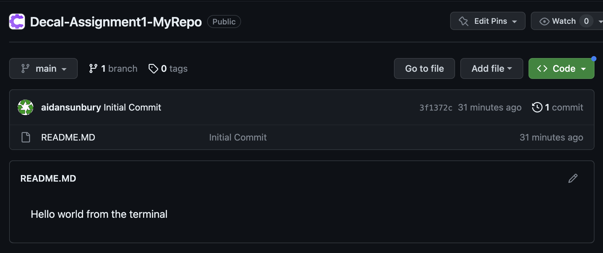
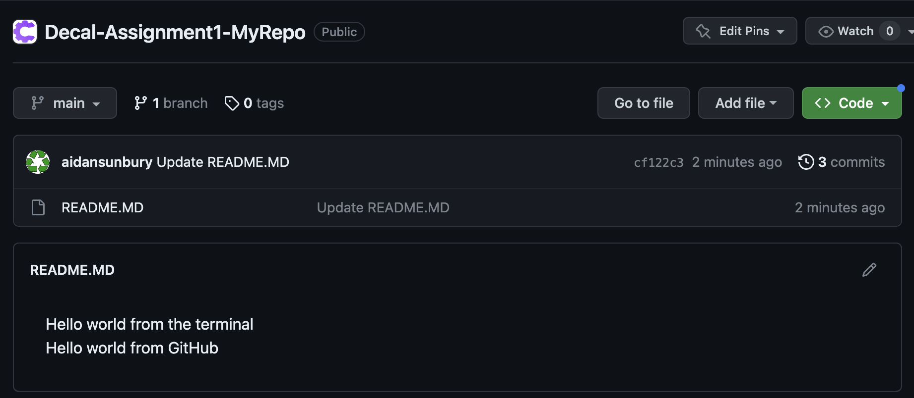

# Assignment 1: Git and Command Line Basics

## Assignment Purpose and Goals

## Assignment Overview

This assignment has two parts. In Assignment-1.1, you will create your own repository from scratch and add a file to it. It will cover the basics of git and GitHub. In Assignment-1.2, you will clone a starter repository, and learn about creating and merging branches.

## Part 1: Configure Git and GitHub

If you do not already have a personal [GitHub](https://github.com/) account, go ahead and make one. Be sure to use a personal email, as all the work you complete on your GitHub account can be used to form a personal portfolio. You will also have to [install git](https://git-scm.com/downloads).

Once you have created a github account, you need to sign in on your local machine so that you can issue commands from your local terminal. There are [several ways to do this](https://docs.github.com/en/authentication/keeping-your-account-and-data-secure/about-authentication-to-github), but we recommend and will demonstrate how to do so through the [github cli](https://cli.github.com/) (command line interface).

1.  Follow the instructions to [download the cli](https://github.com/cli/cli#installation) for your operating system. I'd recommend downloading and using a package manager, [homebrew](https://brew.sh/) for mac and [chocolatey](https://chocolatey.org/install) for windows. After, verify your installation by running the command >gh --version
    ```console
    aidan@Aidans-MBP-4 ~ % gh --version
    gh version 2.24.3 (2023-03-09)
    https://github.com/cli/cli/releases/tag/v2.24.3
    ```
2.  Run the command >gh auth login and select Github.com, HTTPS, Yes, Login with a web browser, and copy the one-time code

    ```console
    aidan@Aidans-MBP-4 ~ % gh auth login
     ? What account do you want to log into? GitHub.com
     ? What is your preferred protocol for Git operations? HTTPS
     ? Authenticate Git with your GitHub credentials? Yes
     ? How would you like to authenticate GitHub CLI? Login with a web browser
     ! First copy your one-time code: F485-11B8
     Press Enter to open github.com in your browser...
    ```

3.  Enter the one time code into the browser, and then press authorize on the next page
4.  In your terminal, you should see that you are now logged in. You can double check by running the command >gh auth status

    ```console
    aidan@Aidans-MBP-4 ~ % gh auth status
    github.com
        ✓ Logged in to github.com as aidansunbury (/Users/aidan/.config/gh/hosts.yml)
        ✓ Git operations for github.com configured to use https protocol.
        ✓ Token: gho\_****************\*\*\*\*****************
        ✓ Token scopes: gist, read:org, repo, workflow
    ```

5.  Finally, you will want to configure git to add the correct name and email address to all of your commits. To do this run
    ```console
    aidan@Aidans-MBP-4 ~ % git config --global user.name "Your Name"
    aidan@Aidans-MBP-4 ~ % git config --global user.email email@gmail.com
    ```

## Part 2: Create a git repository and upload it to github

The rest of this assignment, except for the steps that tell you otherwise, can and should be completed entirely through the command line. While it may be confusing and slow at first, learning to use the command line will vastly increase your productivity as a developer.

1. Open the command line (powershell on windows or terminal on mac) and navigate to a directory (folder) where you want to create a git repository.

When you first open your terminal, it is likely to open to your root directory. You can view your current directory (print working directory) with the command **>pwd**

```console
aidan@Aidans-MBP-4 ~ % pwd
/Users/aidan
```

You can view all of your current directory's subdirectories with the command **>ls**

```console
aidan@Aidans-MBP-4 ~ % ls
Applications
Desktop
Documents
Downloads
```

And you can navigate to one of these subdirectories with the command **>cd [subdirectory]**

```console
aidan@Aidans-MBP-4 ~ % cd Documents
aidan@Aidans-MBP-4 Documents % pwd
/Users/aidan/Documents
```

To navigate to a parent directory, use **>cd ../**

```console
aidan@Aidans-MBP-4 ~ % cd ../
aidan@Aidans-MBP-4 Documents % pwd
/Users/aidan
```

These commands can also be chained to navigate multiple directories at once.

Once in your desired directory, create a new directory to house our git repository with **>mkdir [directory-name]** and cd into it.

```console
aidan@Aidans-MBP-4 Documents % mkdir MyRepo
aidan@Aidans-MBP-4 Documents % cd MyRepo
aidan@Aidans-MBP-4 MyRepo %
```

Initialize a git repo with **>git init**

```console
aidan@Aidans-MBP-4 MyRepo % git init
Initialized empty Git repository in /Users/aidan/Documents/Codify Projects/Decal/MyRepo/.git/
```

Create a README.md file from the terminal using the touch command **>touch README.MD**

```console
aidan@Aidans-MBP-4 MyRepo % touch README.MD
```

Write "Hello world from the terminal" to the README.md file. Executing **>echo** returns the output of the command or value it is passed (in this case just a string) and >> writes to the end of a file. We can verify we were successful by running **>cat [filename]** to display the contents of a file.

```console
aidan@Aidans-MBP-4 MyRepo % echo "Hello world from the terminal" >> README.MD
aidan@Aidans-MBP-4 MyRepo % cat README.MD
Hello world from the terminal
```

Now we have added and modified files within our git repository. However, these files are not being tracked yet. We can view our current status with **>git status**

```console
aidan@Aidans-MBP-4 MyRepo % git status
On branch main

No commits yet

Untracked files:
  (use "git add <file>..." to include in what will be committed)
	README.MD

nothing added to commit but untracked files present (use "git add" to track)
```

Now add all untracked files with **>git add .** also run **>git status** again to see that our file has been staged for a commit.

```console
aidan@Aidans-MBP-4 MyRepo % git add .
```

In order to "save" our work, we now need to commit out changes with **>git commit**, and supply a message describing our commit with the **-m** tag.

```console
aidan@Aidans-MBP-4 MyRepo % git commit -m "Initial Commit"
[main (root-commit) 3f1372c] Initial Commit
 1 file changed, 1 insertion(+)
 create mode 100644 README.MD
```

At any point, you can view your commit history with the command **>git log**

In order for other people to collaborate on your repository and for git to actually be useful, we need to be able to upload it to github. We will show you first how to do this through the github cli, but if you prefer, you may follow the directions for uploading a local repo using the [github site](https://docs.github.com/en/migrations/importing-source-code/using-the-command-line-to-import-source-code/adding-locally-hosted-code-to-github#adding-a-local-repository-to-github-using-git).

Run the command **>gh repo create** and follow the prompts. Be sure to select Push an existing repository to GitHub, the current directory as the path (just select the default), and set the visibility to public.

```console
aidan@Aidans-MBP-4 MyRepo % gh repo create
? What would you like to do? Push an existing local repository to GitHub
? Path to local repository .
? Repository name Decal-Assignment1-MyRepo
? Repository owner Codify-Club-Berkeley
? Description Student Created Repo for Decal Assigment 1
? Visibility Public
✓ Created repository Codify-Club-Berkeley/Decal-Assignment1-MyRepo on GitHub
? Add a remote? Yes
? What should the new remote be called? origin
✓ Added remote https://github.com/Codify-Club-Berkeley/Decal-Assignment1-MyRepo.git
? Would you like to push commits from the current branch to "origin"? Yes
```

Now navigate to the remote url output by the terminal, and you should see your README.MD file in a GitHub repository.



Currently, there is only contributor in this repository, but in a large team, many people will be pushing code to the remote repository, and you will have to pull that code back down into your local repository to view and build on those changes. We will simulate this by editing the file right from GitHub (don't complete this part of the assignment in the terminal).
Click the pencil icon to edit README.MD, and in the interactive editor, add a **\\** at the end of "Hello world from the terminal" to make a new line, and then add the text "Hello world from GitHub". Press commit changes and commit the changes directly to main with the default commit message. Your repo should now look like this.



If you reopen README.MD on your local machine, these changes will not be reflected. To fix this, run the command **>git pull origin main** and the changes will be added to your local repository.

```console
aidan@Aidans-MBP-4 MyRepo % cat README.MD
Hello world from the terminal \
Hello world from GitHub
```

You are now finished with the first part of the assignment. You will get full credit if your README.MD file contains the two lines we added and your repo has at least two commits.

## Part 3: Clone and work with an existing git repository

To you want to make a copy of a remote repository on your local device, you need to "clone" the repository using a url. In this case, you will need to clone the starter repository.

1.

branching, pull request, merging, git diff,

In order to get full credit, you must have

## Part 4: Submission, grading, and more resources
