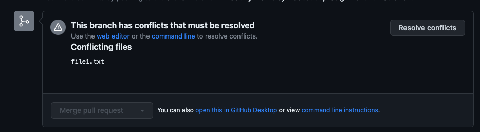

# Assignment 1: Git and Command Line Basics

:::info
Get started on this assignment after lecture 1. Assignment is due 9/15/23 at 11:59pm.
:::

## Assignment Link

[Accept the assignment](https://classroom.github.com/a/DTwZ-B86)

:::info
After accepting this first assignment, you will be prompted to join the GitHub classroom for the course. Select your name from the list to link your GitHub account, or if your name does not appear then add it.
:::

## Assignment Overview

This assignment has two parts. In Assignment-1.1, you will create your own repository from scratch and add a file to it. It will cover the basics of git and GitHub. In Assignment-1.2, you will clone a starter repository, and learn about creating and merging branches.

:::caution
This assignment gives very detailed instructions and walkthrough of how to complete it because a good understanding of Git and GitHub is essential to success as a developer and in this course. Future assignments will give far less detailed instructions.
:::

## Part 1: Configure Git and GitHub

If you do not already have a personal [GitHub](https://github.com/) account, go ahead and make one. Be sure to use a personal email, as all the work you complete on your GitHub account can be used to form a personal portfolio. You will also have to [install git](https://git-scm.com/downloads). Hopefully you have already completed these steps in the setup assignment!

Once you have created a github account, you need to sign in on your local machine so that you can issue commands from your local terminal. There are [several ways to do this](https://docs.github.com/en/authentication/keeping-your-account-and-data-secure/about-authentication-to-github), but we recommend and will demonstrate how to do so through the [github cli](https://cli.github.com/) (command line interface).

1.  Follow the instructions to [download the cli](https://github.com/cli/cli#installation) for your operating system. I'd recommend downloading and using a package manager, [homebrew](https://brew.sh/) for mac and [chocolatey](https://chocolatey.org/install) for windows. After, verify your installation by running the command >gh --version
    ```console
    aidan@Aidans-MBP-4 ~ % gh --version
    gh version 2.24.3 (2023-03-09)
    https://github.com/cli/cli/releases/tag/v2.24.3
    ```
2.  Run the command >gh auth login and select Github.com, HTTPS, Yes, Login with a web browser, and copy the one-time code

    ```console
    aidan@Aidans-MBP-4 ~ % gh auth login
     ? What account do you want to log into? GitHub.com
     ? What is your preferred protocol for Git operations? HTTPS
     ? Authenticate Git with your GitHub credentials? Yes
     ? How would you like to authenticate GitHub CLI? Login with a web browser
     ! First copy your one-time code: F485-11B8
     Press Enter to open github.com in your browser...
    ```

3.  Enter the one time code into the browser, and then press authorize on the next page
4.  In your terminal, you should see that you are now logged in. You can double check by running the command >gh auth status

    ```console
    aidan@Aidans-MBP-4 ~ % gh auth status
    github.com
        ✓ Logged in to github.com as aidansunbury (/Users/aidan/.config/gh/hosts.yml)
        ✓ Git operations for github.com configured to use https protocol.
        ✓ Token: gho\_****************\*\*\*\*****************
        ✓ Token scopes: gist, read:org, repo, workflow
    ```

5.  Finally, you will want to configure git to add the correct name and email address to all of your commits. To do this run
    ```console
    aidan@Aidans-MBP-4 ~ % git config --global user.name "Your Name"
    aidan@Aidans-MBP-4 ~ % git config --global user.email email@gmail.com
    ```

## Part 2: Create a git repository and upload it to github

The rest of this assignment, except for the steps that tell you otherwise, can and should be completed entirely through the command line. While it may be confusing and slow at first, learning to use the command line will vastly increase your productivity as a developer.

1. Open the command line (powershell on windows or terminal on mac) and navigate to a directory (folder) where you want to create a git repository.

When you first open your terminal, it is likely to open to your root directory. You can view your current directory (print working directory) with the command **>pwd**

```console
aidan@Aidans-MBP-4 ~ % pwd
/Users/aidan
```

You can view all of your current directory's subdirectories with the command **>ls**

```console
aidan@Aidans-MBP-4 ~ % ls
Applications
Desktop
Documents
Downloads
```

And you can navigate to one of these subdirectories with the command **>cd [subdirectory]**

```console
aidan@Aidans-MBP-4 ~ % cd Documents
aidan@Aidans-MBP-4 Documents % pwd
/Users/aidan/Documents
```

To navigate to a parent directory, use **>cd ../**

```console
aidan@Aidans-MBP-4 ~ % cd ../
aidan@Aidans-MBP-4 Documents % pwd
/Users/aidan
```

These commands can also be chained to navigate multiple directories at once.

Once in your desired directory, create a new directory to house our git repository with **>mkdir [directory-name]** and cd into it.

```console
aidan@Aidans-MBP-4 Documents % mkdir MyRepo
aidan@Aidans-MBP-4 Documents % cd MyRepo
aidan@Aidans-MBP-4 MyRepo %
```

Initialize a git repo with **>git init**

```console
aidan@Aidans-MBP-4 MyRepo % git init
Initialized empty Git repository in /Users/aidan/Documents/Codify Projects/Decal/MyRepo/.git/
```

Create a README.md file from the terminal using the touch command **>touch README.MD**

```console
aidan@Aidans-MBP-4 MyRepo % touch README.MD
```

Write "Hello world from the terminal" to the README.md file. Executing **>echo** returns the output of the command or value it is passed (in this case just a string) and >> writes to the end of a file. We can verify we were successful by running **>cat [filename]** to display the contents of a file.

```console
aidan@Aidans-MBP-4 MyRepo % echo "Hello world from the terminal" >> README.MD
aidan@Aidans-MBP-4 MyRepo % cat README.MD
Hello world from the terminal
```

Now we have added and modified files within our git repository. However, these files are not being tracked yet. We can view our current status with **>git status**

```console
aidan@Aidans-MBP-4 MyRepo % git status
On branch main

No commits yet

Untracked files:
  (use "git add <file>..." to include in what will be committed)
	README.MD

nothing added to commit but untracked files present (use "git add" to track)
```

Now add all untracked files with **>git add .** also run **>git status** again to see that our file has been staged for a commit.

```console
aidan@Aidans-MBP-4 MyRepo % git add .
```

In order to "save" our work, we now need to commit out changes with **>git commit**, and supply a message describing our commit with the **-m** tag.

```console
aidan@Aidans-MBP-4 MyRepo % git commit -m "Initial Commit"
[main (root-commit) 3f1372c] Initial Commit
 1 file changed, 1 insertion(+)
 create mode 100644 README.MD
```

At any point, you can view your commit history with the command **>git log**

In order for other people to collaborate on your repository and for git to actually be useful, we need to be able to upload it to github. We will show you first how to do this through the github cli, but if you prefer, you may follow the directions for uploading a local repo using the [github site](https://docs.github.com/en/migrations/importing-source-code/using-the-command-line-to-import-source-code/adding-locally-hosted-code-to-github#adding-a-local-repository-to-github-using-git).

Run the command **>gh repo create** and follow the prompts. Be sure to select Push an existing repository to GitHub, the current directory as the path (just select the default), and set the visibility to public.

```console
aidan@Aidans-MBP-4 MyRepo % gh repo create
? What would you like to do? Push an existing local repository to GitHub
? Path to local repository .
? Repository name Decal-Assignment1-MyRepo
? Repository owner Codify-Club-Berkeley
? Description Student Created Repo for Decal Assigment 1
? Visibility Public
✓ Created repository Codify-Club-Berkeley/Decal-Assignment1-MyRepo on GitHub
? Add a remote? Yes
? What should the new remote be called? origin
✓ Added remote https://github.com/Codify-Club-Berkeley/Decal-Assignment1-MyRepo.git
? Would you like to push commits from the current branch to "origin"? Yes
```

Now navigate to the remote url output by the terminal, and you should see your README.MD file in a GitHub repository.


Currently, there is only contributor in this repository, but in a large team, many people will be pushing code to the remote repository, and you will have to pull that code back down into your local repository to view and build on those changes. We will simulate this by editing the file right from GitHub (don't complete this part of the assignment in the terminal).
Click the pencil icon to edit README.MD, and in the interactive editor, add a **\\** at the end of "Hello world from the terminal" to make a new line, and then add the text "Hello world from GitHub". Press commit changes and commit the changes directly to main with the default commit message. Your repo should now look like this.


If you reopen README.MD on your local machine, these changes will not be reflected. To fix this, run the command **>git pull origin main** and the changes will be added to your local repository.

```console
aidan@Aidans-MBP-4 MyRepo % cat README.MD
Hello world from the terminal \
Hello world from GitHub
```

You are now finished with the first part of the assignment!

## Part 3: Clone and work with an existing git repository

To you want to make a copy of a remote repository on your local device, you need to "clone" the repository using a url. In this case, you will need to clone the starter repository.

1. Accept the assignment if you have not already with the link at the top of the page.
2. Navigate to the in the starter repo, click the "code" dropdown. Copy the clone HTTPS url.
3. Run **>git clone [repo-url]** in your command line in the folder you want the repository you want to clone into.
4. Open the newly created folder in VS Code

Now that we have the new repository, we want to start making changes to it. Start by making two new branches named branch1 and branch2. Make sure to verify that the branches exist.

```Console
aidan@Aidans-MBP-4 Assignment-1.2-Starter % git branch branch1 # Create a branch named branch1
aidan@Aidans-MBP-4 Assignment-1.2-Starter % git branch branch2 # Create a branch named branch2
aidan@Aidans-MBP-4 Assignment-1.2-Starter % git branch # prints all available branches
branch1
branch2
* main # The current branch will have an * in front
```

Now we can switch between each of these branches with **>git checkout [branch-name]**. In this case, pretend we are working on two different features on a project, and so we want to keep our work histories on each of these separated.

```Console
aidan@Aidans-MBP-4 Assignment-1.2-Starter % git checkout branch1 # Switch to branch1
aidan@Aidans-MBP-4 Assignment-1.2-Starter % git branch
* branch1 # Now we are on branch1
branch2
main
```

:::danger
Now that you know how to create branches within Git repositories, **NEVER** ever make changes directly to the main branch. Always use a new branch for whatever changes you are working on, then merge it into the main branch when you are finished. This process will be outlined in the rest of this assignment.
:::

Open up **file1.txt** and change line 3 to say "You are student number 2". Add and commit (with a useful commit message!) the changes to branch1. Now toggle back and forth between the main branch and branch1. You should see file1.txt update to reflect your changes each time you change your branch.

But how do we merge these changes into our master branch? The standard practice is to first push the changes to GitHub, and then make a pull request. Start by pushing your changes from branch1, and then navigate to the repository on GitHub.

```console
aidan@Aidans-MBP-4 Assignment-1.2-Starter % git push origin branch1
Total 0 (delta 0), reused 0 (delta 0), pack-reused 0
remote:
remote: Create a pull request for 'branch1' on GitHub by visiting:
remote:      https://github.com/aidansunbury/Assignment-1.2-Starter/pull/new/branch1
remote:
To https://github.com/aidansunbury/Assignment-1.2-Starter.git
 * [new branch]      branch1 -> branch1
```

Click the branch dropdown to navigate to branch1. Click on the **1 commit ahead** link text to generate a new pull request for this branch.


From here, you can name your pull request, write a description of all changes, and add reviewers to the pull request. For this assignment, name the pull request "Updated Student Number" and add a description. Then press create pull request.


The next screen will show you the details of the pull request. Other collaborators on the repository can leave comments of the pull request, or conduct a formal review. In this case, there is nothing we need to review, so go ahead and merge the pull request. And delete the branch.

:::tip
It is best practice to select the option to "squash and merge" instead of just merging the pull request. This will squash all of the commits made on the feature branch into a single commit once it is merged onto the main branch. As feature branches can easily have 20+ commits each, it is cumbersome to view all of these commits on the main branch. Squashing allows each change to the main branch to be viewed as a single easy to understand commit.
:::


Now go back to your local repository and **>git pull** from the main branch. You should see your changes reflected in file1.txt. You may also notice that if you run **>git branch**, branch1 still appears despite the fact that we deleted it. This is normal and reflects an important feature of Git's distributed nature. Deleting the branch on the remote repository does not delete the branch locally. This is the same reason we had to pull the changes from the remote repository before we saw the updates reflected in our local main branch.

Normally after a branch is already merged into main on the remote repository, we no longer need it locally. Run **>git branch -D branch1**

```console
aidan@Aidans-MBP-4 Assignment-1.2-Starter % git branch -D branch1
Deleted branch branch1 (was c0d3e5b).
```

Now switch over to branch2 so that we can make some more changes. Open up **file1.txt** again and this time change line 3 to say "You are student number 3". Add, commit, and push the changes to GitHub. Create a new pull request, still making sure to give it an informative title and description of the changes.

On this new PR, there are conflicts with the main branch which must be resolved. We edited the student number on multiple different branches, and as a result GitHub does not know which change we want to keep and which change we want to override.



Click resolve conflicts see what lines are conflicting. Here you see that since we edited the same line on two different branches, and GitHub wants us to choose which branches' changes to keep. In this case, let's keep the changes we made on branch2, deleting the equals signs, >>> signs and <<< signs, and all of the content from the main branch.


When you are all done, your file1.txt should look something like this. When it does, go ahead and click **mark as resolved** and **Commit merge**.


Now merge and delete branch2. Congratulations! You have now finished your first assignment.

## Part 4: Submission and grading

The auto grader will run the following checks on your assignments. Each check is worth the same number of points.

### Assignment 1.1

In order to grade this assignment, we would have had to use have you clone a repository with tests already in it instead of having you create a repository from scratch. As a result, there is nothing to turn in for the first part of the assignment.

### Assignment 1.2

1. file1.txt must contain the line "You are student number 3"
2. There must be two closed pull requests
3. There are at least two commits on the main branch, one for each branch we merged into main. These commits must be auto generated commits from merging pull request numbers 1 and 2.
4. There must only be one active branch (the main branch)

If you have any issues with the auto grader, or believe your submission should be passing the tests but does not, then please send a message in the Discord Server ASAP!
