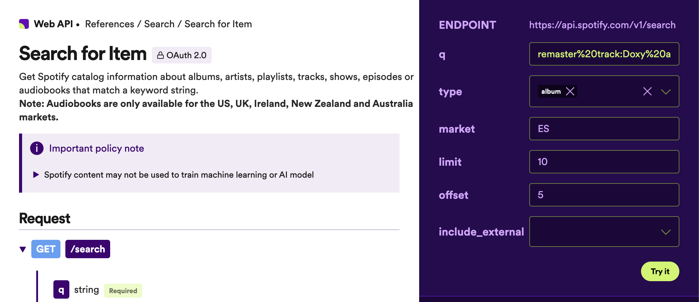

# Assignment 4 APIs

## Assignment Link

## Assignment Overview

In this assignment, you will use the Spotify API to recommended songs based on a user's favorite songs, albums, and artists. We will walk you through making a few simple API calls yourself, and then let you free.

:::info
For a variety of reasons, this assignment will not have auto grader tests. First, the Spotify recommendations API may change what it recommends over time as new songs come out. Second, in the time it would take to create robust auto grader test cases, the course staff could instead create more new assignments or better lecture slides. Our ultimate goal is to maximize learning, not maximize our ability to measure learning.
:::

## Setting up Bun

For this assignment, we are trying out a new package manager and NodeJs alternative. Bun! Check out [the docs](https://bun.sh/docs/installation) to install it, and instead of using the prefix npm/npx, use bun to install packages or execute files. If you encounter issues using Bun on Windows, it may make sense to delete the package.json, and recreate the project with npm. If you have issues with this, please message in the discord and/or come to office hours.

## Access the Spotify API

In order to use the Spotify API, we need to get an access token. We will be following the [client credentials](https://developer.spotify.com/documentation/web-api/tutorials/client-credentials-flow) authorization flow.

1. Create a Spotify account if you do not already have one. It can be a free account.
2. Log into Spotify through the [developer portal](https://developer.spotify.com/). Then view your Spotify [developer dashboard](https://developer.spotify.com/dashboard) and click "Create app"
3. Fill in all of the fields. We will not need a redirect URI, so just input any url (such as https://www.google.com/)
4. Once the app is created, click on the app and then click settings. We will use the copy Client ID and Client Secret into the .env file. Once you have them added to your .env file, add .env to the end of your .gitignore file so that you don't accidentally publish them to GitHub.

Throughout this assignment, you can test your solutions and explore additional capabilities of the Spotify API through the [Web API docs](https://developer.spotify.com/documentation/web-api). I recommend you leave them open for reference throughout the assignment.

## Getting an access token

Your Client ID and Client Secret are not enough to access the Spotify API. You need to ask Spotify to verify the Client ID and Client Secret and give you an access token to accompany all requests. This is handled for you with the getToken.ts file. Run the file with **>bun getToken.ts**, and your .env file should be updated with an access token. Now we are ready to start requesting data from the API!

Unfortunately, these access tokens expire every hour, and you will need to rerun **>bun getToken.ts** every hour to get a new access token.

## Problem 1: Get an artist id

This first problem walks you through step by step how we will make a sample API call. We need to build out our request URI, and provide our access token in our headers. All of the requests we make in this assignment will look something like this.

```typescript
// Get the response
const response: any = await ky.get(encodeURI(request_uri), authOptions).json();
// encodeURI replaces characters not allowed to be part of a URI with their URI equivalents.
// For example, spaces are replaced with %20 and commas are replaced with %2C
```

We already have the **authOptions** object set up for you, so all you need to do is import it from **constants.ts**. The only thing we need to change is the request_uri.

All of the request URIs for the Spotify API, and most web APIs, are structured like this:

```typescript
const uri = "https://api.spotify.com/v1/{endpoint}/{query-parameters}";
```

We have a base URI, an endpoint, and all of our query parameters.

For this problem, we are going to user the [search endpoint](https://developer.spotify.com/documentation/web-api/reference/search) to find the id of a given artist after searching for them. We need to be able to get the id of artists, albums, and tracks, because we access these resources from the API using the id, not the name. The code is mostly scaffolded for you, so just fill in the blanks with the //TODO comments.

### Checking your solution

Because this assignment is not autograded, the best way to check your solution is by using the web api client in embedded in the API docs themselves. Run your file with your function, and log the output to the console. Then, you can see if the output matches the output you get from the web api client, or you can simply log into Spotify and verify the information for yourself.



You can try running queries using either their built in web interface, or using the curl commands it outputs. For most questions, we will also provide a few sample outputs that you can check your answers against. For others, you can open the Spotify app and check the results yourself!

```typescript
// Expected Outputs
getArtistId("Taylor Swift"); //06HL4z0CvFAxyc27GXpf02
getArtistId("Kendrick Lamar"); //2YZyLoL8N0Wb9xBt1NhZWg
getArtistId("Taylor Swift"); //null (there is no artist with that exact name spelling)
```

## Problem 2: Get anything

Besides artists, we also want to be able to get albums and individual tracks (songs). We also want to bundle the information about the name, id, and resource type (track, artist, or album) into a single Resource object (the Resource type is defined for you in types.ts). Build upon your getArtistId function to be able to return a resource object for any type of resource, given the name of the resource. Return null if there is no resource that matches the given name.

:::warning
You only need to worry about implementing the a simple solution that assumes there is only one exact result for your search query. In reality, searching a track like "Skin" will match songs by Sabrina Carpenter, Rihanna, Mac Miller, and several other artists. Don't worry about implementing these edge cases right off the bat, but later feel free to modify your function to return all of the results that are an exact match.

While you are testing your solution, use unique track/album/artist names if you would like to avoid these edge cases.
:::

```typescript
// Sample Inputs
let response1: Resource = await getItem("Olivia Rodrigo", "artist");
let response2: Resource = await getItem("Olivia Rodrigo", "album");
let response3: Resource = await getItem("Red (Taylor's Version)", "album");
let response4: Resource = await getItem("Plastic Hearts", "track");

// Expected Outputs
response1 = {
  name: "Olivia Rodrigo",
  SpotifyID: "1McMsnEElThX1knmY4oliG",
  type: "artist",
};
response2 = null; // There is no album titled "Olivia Rodrigo"
response3 = {
  name: "Red (Taylor's Version)",
  SpotifyID: "6kZ42qRrzov54LcAk4onW9",
  type: "album",
};
response4 = {
  name: "Plastic Hearts",
  SpotifyID: "6qCsKKS7Ol63SJW3LOIX5R",
  type: "track",
};
```

:::info
Completing this assignment would be all but impossible without referencing the Spotify API docs. For this question, reference their documentation on the [search endpoint](https://developer.spotify.com/documentation/web-api/reference/search). For each remaining question, we will link the corresponding endpoint in the Spotify docs.
:::

## Problem 3: Get an artist's albums

Use your getItem function to get all of an artist's albums given the artist's name. Return an array of Resource objects, which should only contain albums. If the artist does not have any albums, return an empty array. If there is no artist with the given name, return null.

Reference the [artist's albums endpoint](https://developer.spotify.com/documentation/web-api/reference/get-an-artists-albums) to help you with this problem.

```typescript
let response: Resource[] = await getAlbums("Travis Scott");

// Expected response
response = [
  {
    name: "UTOPIA",
    SpotifyID: "18NOKLkZETa4sWwLMIm0UZ",
    type: "album",
  },
  {
    name: "JACKBOYS",
    SpotifyID: "1Sf8GsXG32t0jNrX11xqWx",
    type: "album",
  },
  {
    name: "ASTROWORLD",
    SpotifyID: "41GuZcammIkupMPKH2OJ6I",
    type: "album",
  },
  {
    name: "Huncho Jack, Jack Huncho",
    SpotifyID: "6FED8aeieEnUWwQqAO9zT1",
    type: "album",
  },
  {
    name: "Birds In The Trap Sing McKnight",
    SpotifyID: "42WVQWuf1teDysXiOupIZt",
    type: "album",
  },
  {
    name: "Rodeo",
    SpotifyID: "4PWBTB6NYSKQwfo79I3prg",
    type: "album",
  },
];
```

## Problem 4: Get and Album's Tracks

Similarly to how you got an artist's albums, try getting all of the albums on a track given the album's name. Return an array of Resource objects, which should only contain tracks. If the album does not have any tracks, return an empty array. If there is no album with the given name, return null.

Reference the [album's tracks endpoint](https://developer.spotify.com/documentation/web-api/reference/get-an-albums-tracks) to help you with this problem.

```typescript
let response: Resource[] = await getTracks("how i'm feeling now");

// Expected response
response = [
  {
    name: "pink diamond",
    SpotifyID: "3V0PgcsUMlAGXwCD0084pY",
    type: "track",
  },
  {
    name: "forever",
    SpotifyID: "5GsJIVCBFjhCcUwJaTW2sB",
    type: "track",
  },
  {
    name: "claws",
    SpotifyID: "7Dexi5Z2IowCkHrnzlWysc",
    type: "track",
  },
  {
    name: "7 years",
    SpotifyID: "4jQDJPgw3qkc1T2f1safdy",
    type: "track",
  },
  {
    name: "detonate",
    SpotifyID: "1M6VHCglQ2PLWeAsyhgEUH",
    type: "track",
  },
  {
    name: "enemy",
    SpotifyID: "51qNCY0lUymE88LPDUqFXd",
    type: "track",
  },
  {
    name: "i finally understand",
    SpotifyID: "2PBcNVg8jB1e5kVkjXJyZ5",
    type: "track",
  },
  {
    name: "c2.0",
    SpotifyID: "5gNTRfMRPZg1U07j7KSSaG",
    type: "track",
  },
  {
    name: "party 4 u",
    SpotifyID: "2RdEC8Ff83WkX7kDVCHseE",
    type: "track",
  },
  {
    name: "anthems",
    SpotifyID: "2ljvO8ZpKFMT3HXwCjW4Yw",
    type: "track",
  },
  {
    name: "visions",
    SpotifyID: "5oZIhePTCzvWskktjYgdjr",
    type: "track",
  },
];
```

:::note
As an optional extension, try creating a function in a new file that combines your answers to problems 3 and 4 to get all of an artist's tracks given the artist's name.
:::

## Problem 5: Recommend me a song!

So far we have done lots of querying, but we haven't actually gotten recommended any songs. To start, we will simply recommend the most popular song from an album or artist outside of a list of excluded songs that we have "already listened to."

For getting an artist's most popular songs, use the pre defined [Artist's top tracks](https://developer.spotify.com/documentation/web-api/reference/get-an-artists-top-tracks) endpoint, and return the first result.

There is no endpoint for the most popular song in an album, but every track returned by the Spotify API has a popularity associated with it. To get the most popular song in an album, get all of the tracks in the album, and then return the track with the highest popularity. Use the same album's tracks endpoint that you used in problem 4.

:::tip
Since our approach is different depending on if the resource is an album or an artist, you may want to create two separate functions to handle each case. Then, you can call the appropriate function from the recommendSong function.
:::

```typescript
const artistSeed: Resource = {
  name: "Olivia Rodrigo",
  SpotifyID: "1McMsnEElThX1knmY4oliG",
  type: "artist",
};
const albumSeed: Resource = {
  name: "Red (Taylor's Version)",
  SpotifyID: "6kZ42qRrzov54LcAk4onW9",
  type: "album",
};

// excluded songs should not be returned, even if they are the most popular
const excludedSongs: Resource[] = [
  {
    name: "drivers license",
    SpotifyID: "7lPN2DXiMsVn7XUKtOW1CS",
    type: "track",
  },
  {
    name: "deja vu",
    SpotifyID: "6PERP62TejQjgHu81OHxgM",
    type: "track",
  },
  {
    name: "good 4 u",
    SpotifyID: "6PERP62TejQjgHu81OHxgM",
    type: "track",
  },
];

let response1: Resource = await recommendSong(artistSeed, []); // No excluded songs

// Expected output
response1 = {
  name: "vampire",
  SpotifyID: "1kuGVB7EU95pJObxwvfwKS",
  type: "track",
};

let response2: Resource = await recommendSong(artistSeed, excludedSongs); // With some excluded songs

// Expected output
response2 = {
  name: "get him back!",
  SpotifyID: "2gyxAWHebV7xPYVxqoi86f",
  type: "track",
};

let response3: Resource = await recommendSong(albumSeed, []); // Try an album this time

// Expected output
response3 = {
  name: "All Too Well (10 Minute Version) (Taylor's Version) (From The Vault)",
  SpotifyID: "5enxwA8aAbwZbf5qCHORXi",
  type: "track",
};
```

You should also be able to verify that your recommendation function is returning an artist's top songs by checking them out in Spotify. As we can see (as of the date this assignment is created!) Olivia Rodrigo's most popular track is "vampire", and her most popular track not in our list of excluded tracks is "get him back!"


:::warning
The data for this problem is likely to become out of date very quickly. As a result, don't worry if you don't get exactly the same output.
:::

:::note
Our current implementation returns a song recommendation based on popularity, but it does not actually say how popular the song it. As an optional extension, try modifying your function to return a tuple with the song resource, and the popularity of the song.
:::

## Problem 6: Recommend me some more!

Getting a single song, the most popular one at that, isn't altogether too interesting. Fortunately, Spotify can recommend us a whole playlist of songs based on a set of criteria we specify. Given a list of artist resources and song resources to use as a seed, and a settings object (defined in types.ts), return Spotify's recommended tracks.

Reference the [recommendations endpoint](https://developer.spotify.com/documentation/web-api/reference/get-recommendations) to see exactly how to format your request.

```typescript
// Used to specify the target attributes of recommended from the /recommendations endpoint
// All values are 0-1 except for popularity, which is 0-100
const options: Settings = {
  target_danceability: 0.7,
  target_energy: 0.7,
  target_instrumentalness: 0.1,
  target_popularity: 40,
};

// Admittedly, a very strange set of seed resources but if you want
// to change it, help teach the education program next semester!
const seedResources: Resource[] = [
  {
    name: "vampire",
    SpotifyID: "1kuGVB7EU95pJObxwvfwKS",
    type: "track",
  },
  {
    name: "bad idea right?",
    SpotifyID: "3IX0yuEVvDbnqUwMBB3ouC",
    type: "track",
  },
  {
    name: "Kendrick Lamar",
    SpotifyID: "2YZyLoL8N0Wb9xBt1NhZWg",
    type: "artist",
  },
  {
    name: "Kanye West",
    SpotifyID: "5K4W6rqBFWDnAN6FQUkS6x",
    type: "artist",
  },
];

let response = await recommendPlaylist(seedResources, options);

// It is very likely you will not get this exact output, as the recommendations API changes over time
// However, your output should be similar
response = [
  {
    name: "Xscape (feat. A$AP Twelvyy)",
    SpotifyID: "5suOxurRGMcdcPwJJjkgRG",
    type: "track",
  },
  {
    name: "Bop to the Top - Nini & Kourtney Version",
    SpotifyID: "2po9ojtzr8XpirRFNHjO83",
    type: "track",
  },
  {
    name: "Crushing Me - From the Paramount+ Series ‘Grease: Rise of the Pink Ladies'",
    SpotifyID: "3jcUMe0q7KTHfJsGaWU8Oa",
    type: "track",
  },
  {
    name: "Heard 'Em Say",
    SpotifyID: "2PFNTHR4sA8m9rPPtYXhl7",
    type: "track",
  },
  {
    name: "21",
    SpotifyID: "2D2lazsae9o1UoVPUAdxyT",
    type: "track",
  },
  {
    name: "Back Like That - Remix",
    SpotifyID: "26E0bdbWy3ekgAMmHN9HlF",
    type: "track",
  },
  {
    name: "She's Pretty",
    SpotifyID: "4DXO0suj4KLYTtO6L3gOby",
    type: "track",
  },
  {
    name: "Love the Haters",
    SpotifyID: "1glFzU55j6ji6xYEMlvEUx",
    type: "track",
  },
  {
    name: "tired of california",
    SpotifyID: "2SOhUiyKpnlshR3SFh733w",
    type: "track",
  },
  {
    name: "We Can Make It Better",
    SpotifyID: "3NR4gpFhwBWJgUtkl8woeY",
    type: "track",
  },
  {
    name: "City Boy Summer",
    SpotifyID: "4HArHoORbKn0ioYA6cDRhz",
    type: "track",
  },
  {
    name: "Fortunate (Feat. Kanye West, Dreezy & CHLLER)",
    SpotifyID: "365eCTLl2eaWqrCGhnZu4e",
    type: "track",
  },
  {
    name: "Game Recognize Game (Interlude)",
    SpotifyID: "0r1QdPRP58kJFeD2vlWvah",
    type: "track",
  },
  {
    name: "Bizaardvark Theme Song",
    SpotifyID: "4lssBDAmUk4e7rv2ajY6H6",
    type: "track",
  },
  {
    name: "Average Joe",
    SpotifyID: "3r4S1J4YCkx2fuqH2eL9fz",
    type: "track",
  },
  {
    name: "i'm mad lol",
    SpotifyID: "0A37VdcNRkc9QzOh4zM1j2",
    type: "track",
  },
  {
    name: "it could’ve been u",
    SpotifyID: "4kUs9LuptVXtLqm2CK9JA7",
    type: "track",
  },
  {
    name: "slivered heart",
    SpotifyID: "4tZL4ZnwuBoGWBg8s8nSu1",
    type: "track",
  },
  {
    name: "SHE SAID HE SAID SHE SAID",
    SpotifyID: "61SwOvGpjoANrBOVgBZvMi",
    type: "track",
  },
  {
    name: "The Comeback Song",
    SpotifyID: "2WLp3CjnM7iLR7aTrNdwcX",
    type: "track",
  },
];
```

:::note
We only specify a subset of the possible query parameters in our settings object. Feel free to add more if you would like to experiment with the recommendations API more. You can also edit the Settings type in types.ts so that you can still pass your additional query parameters in the same settings object.
:::

### Common Pitfalls and Useful Tips

1. The keys of the settings object are the query parameters that you will need to use. You can use the [Object.entries](https://developer.mozilla.org/en-US/docs/Web/JavaScript/Reference/Global_Objects/Object/entries) function to get an array of all of the key value pairs in the object. I also used the .filter function to filter out any undefined keys, the map function to format the key value pairs into a string, and the .join function to join all of the key value pairs together into a single string separated by '&' characters to chain together the query parameters.
2. The recommendations endpoint does not accept albums! If any albums are passed into the seedResources array, you should ignore them.
3. If you are having trouble properly formatting all of the query parameters, try to get the function working with a single song, a single artist, and an empty settings object before implementing the rest of the functionality.
4. Make sure that all of your settings are within the range expected by the API!

## Optional extensions

### Interactive CLI

Currently all of the functionality of our application is hidden behind a function call. Try creating an interactive CLI that allows the user to input their favorite songs, albums, and artists, and then returns a list of recommended songs. Check out this [codeacademy guide](https://www.codecademy.com/article/getting-user-input-in-node-js) which shows you how to get user input in NodeJs.

### Actual User Sign In

Accessing the web API through the a client access token only gives us read access to general Spotify data, and doesn't let us read or write any personal user data. Try implementing the [authorization code](https://developer.spotify.com/documentation/web-api/tutorials/code-pkce-flow) authentication flow, which does let you directly edit your user data through the API. Once you are able to edit your personal account information, try saving our recommended playlists to your profile!
